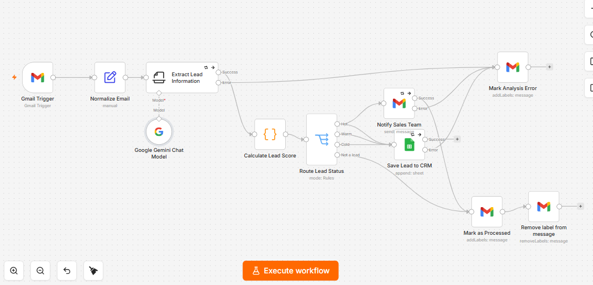

# AI Gmail Lead Qualification & CRM

An end-to-end lead qualification workflow built with **n8n**, **Gmail**, **Google Gemini**, and **Google Sheets**. It monitors labeled inquiry emails, extracts structured lead information, calculates a deterministic score, routes each lead by priority, stores qualified leads in a lightweight CRM, and immediately alerts the sales team about high-value opportunities.



## Features

- Monitors Gmail for new inquiries using the `AI-Leads` label
- Extracts structured lead data with Google Gemini
- Handles incomplete inquiries without inventing missing information
- Calculates a transparent lead score from budget, timeline, completeness, company, and contact details
- Classifies messages as `Hot`, `Warm`, `Cold`, or `Not a Lead`
- Saves qualified leads to Google Sheets
- Sends a formatted HTML email alert for Hot leads
- Marks completed messages as `AI-Processed`
- Prevents duplicate processing by removing the `AI-Leads` label
- Retries temporary Gemini, Google Sheets, and Gmail failures
- Marks failed items with `AI-Errors` for manual review

## Workflow

```text
Gmail Trigger
    ↓
Normalize Email
    ↓
Extract Lead Information (Gemini)
    ↓
Calculate Lead Score
    ↓
Route Lead Status
    ├── Hot  ──→ Google Sheets + Sales Email Alert
    ├── Warm ──→ Google Sheets
    ├── Cold ──→ Google Sheets
    └── Not a Lead ──→ Skip CRM
    ↓
Mark as Processed
    ↓
Remove AI-Leads Label
```

Errors from Gemini, Google Sheets, or the sales notification are routed to the `AI-Errors` label.

## Extracted Lead Fields

- Name
- Email
- Phone
- Company
- Requested service
- Budget
- Timeline in days
- Summary
- Missing fields

## Lead Scoring

The score is deterministic and can be customized for each business.

| Factor | Maximum points |
|---|---:|
| Budget | 40 |
| Timeline | 30 |
| Information completeness | 20 |
| Company provided | 5 |
| Complete contact details | 5 |

| Status | Score |
|---|---:|
| Hot | 70–100 |
| Warm | 40–69 |
| Cold | 0–39 |
| Not a Lead | Non-sales email |

## Google Sheets Columns

Create a spreadsheet named `AI CRM Leads` with these headers in the first row:

```text
Email ID
Received At
Name
Email
Phone
Company
Service
Budget
Timeline Days
Lead Score
Lead Status
Summary
Missing Fields
Score Reasons
Source
```

## Gmail Labels

Create these labels before configuring the workflow:

- `AI-Leads` — new inquiries waiting for processing
- `AI-Processed` — successfully analyzed emails
- `AI-Errors` — items requiring manual review

A Gmail filter can automatically apply `AI-Leads` to messages sent to a dedicated sales address or Gmail plus alias such as `yourname+leads@gmail.com`.

## Setup

1. Import `workflow.json` into n8n.
2. Configure Gmail OAuth credentials for the trigger and Gmail actions.
3. Configure a Google Gemini API credential.
4. Configure Google Sheets OAuth credentials.
5. Replace the placeholder Gmail label IDs with the labels from your account.
6. Select your Google Sheets document and worksheet in `Save Lead to CRM`.
7. Replace `YOUR_SALES_EMAIL@example.com` in `Notify Sales Team`.
8. Create a Gmail filter that applies `AI-Leads` to incoming inquiries.
9. Save, publish, and activate the workflow.

## Tested Scenarios

- Complete high-budget inquiry → Hot lead, CRM row, and sales alert
- Medium-priority inquiry → Warm lead and CRM row
- Early-stage inquiry without a defined budget or timeline → Cold lead and CRM row
- Verification email → Not a Lead, skipped by CRM, and marked as processed
- Missing fields → Safe empty values and a populated `missingFields` list
- Temporary external-service errors → automatic retries and `AI-Errors` label

## Security

- Credentials, API keys, personal email addresses, spreadsheet IDs, and Gmail label IDs are not included in the public workflow.
- Use dedicated client credentials and apply least-privilege access in production.
- Review the scoring rules and data-retention requirements before processing real customer information.

## Possible Extensions

- HubSpot, Salesforce, Airtable, or another CRM instead of Google Sheets
- Automatic follow-up emails for Warm and Cold leads
- Slack, Telegram, or Microsoft Teams sales alerts
- Duplicate detection by email or message ID
- Multilingual qualification rules
- Analytics dashboard and conversion reporting

## Author

**Hiyam Bader**