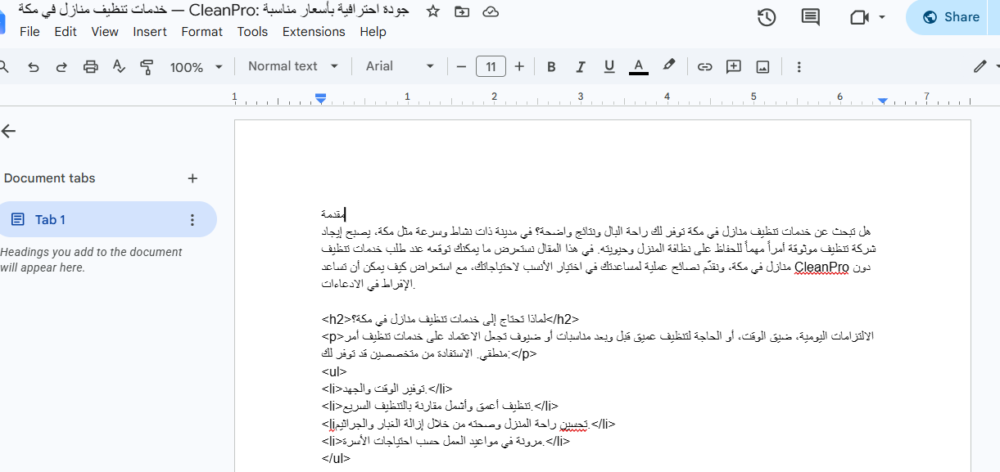
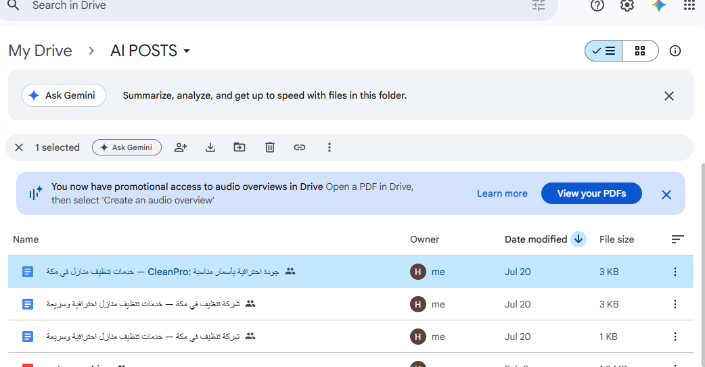
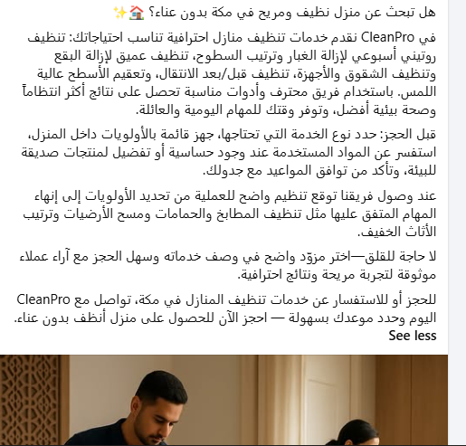

# AI Content Marketing Agent

An end-to-end AI-powered content marketing workflow built with **n8n**.

The workflow automatically selects a local SEO topic, writes a complete article, creates social media content, generates a matching image, saves the article to Google Docs, and publishes the final post to Facebook.

---

## Overview

This project helps local businesses automate their weekly content marketing process.

The workflow:

1. Runs automatically every week.
2. Retrieves active client data from Supabase.
3. Searches Google through SerpAPI for relevant local search ideas.
4. Selects the best keyword and SEO title using AI.
5. Writes a complete SEO article.
6. Saves the article in Google Docs.
7. Generates Facebook and Instagram content.
8. Creates an image-generation prompt.
9. Generates a marketing image with OpenAI.
10. Publishes the image and caption to Facebook.

---

## Features

- Weekly automated execution
- Multi-client support through Supabase
- Local SEO keyword research
- AI content strategy
- Structured JSON outputs
- SEO article generation
- Meta-description generation
- CTA generation
- Facebook post generation
- Instagram caption and hashtag generation
- AI image prompt generation
- AI image generation
- Automatic Google Docs creation
- Automatic Facebook publishing
- Hallucination-reduction rules in prompts

---

## Workflow Architecture

```text
Schedule Trigger
        ↓
Get Client — Supabase
        ↓
Keyword API — SerpAPI
        ↓
AI Content Strategist
        ↓
AI Article Writer
       ├──────────────→ Create Google Document
       │                       ↓
       │                 Update Google Document
       │
       ├──────────────→ AI Social Media Writer
       │
       └──────────────→ AI Image Prompt Writer
                               ↓
                        Generate an Image
                               ↓
                  Merge Image + Social Content
                               ↓
                    Publish to Facebook
```

---

## Tech Stack

- n8n
- OpenAI
- Supabase
- SerpAPI
- Google Docs API
- Facebook Graph API

---

## AI Agents

### 1. AI Content Strategist

Uses the client profile and Google search suggestions to select the best local SEO keyword and article title.

Example output:

```json
{
  "keyword": "home cleaning services in Makkah",
  "reason": "The keyword is directly related to the client's service and targets local search intent.",
  "selected_title": "Home Cleaning Services in Makkah: A Complete Guide",
  "alternative_titles": [
    "How to Choose a Reliable Cleaning Company in Makkah",
    "Home Cleaning Prices in Makkah: What You Should Know"
  ]
}
```

### 2. AI Article Writer

Creates a complete SEO article using the selected keyword and title.

Example output:

```json
{
  "title": "Home Cleaning Services in Makkah: A Complete Guide",
  "meta_description": "Learn how to choose reliable home cleaning services in Makkah.",
  "article": "Full article content...",
  "cta": "Contact the company today to request more information."
}
```

### 3. AI Social Media Writer

Transforms the article into content suitable for Facebook and Instagram.

Example output:

```json
{
  "facebook_post": "Facebook post content...",
  "instagram_caption": "Instagram caption...",
  "hashtags": [
    "#LocalBusiness",
    "#ContentMarketing",
    "#Makkah"
  ]
}
```

### 4. AI Image Prompt Writer

Creates one English prompt for generating a photorealistic image related to the article.

Example output:

```json
{
  "image_prompt": "A professional photorealistic marketing image..."
}
```

---

## Supabase Client Table

The workflow expects a table named:

```text
clients
```

Recommended columns:

| Column | Type | Description |
|---|---|---|
| `id` | UUID or integer | Unique client ID |
| `company_name` | Text | Business name |
| `business` | Text | Business category or service |
| `city` | Text | Target city |
| `language` | Text | Content language |
| `status` | Text | Use `active` for enabled clients |

Example record:

```json
{
  "company_name": "CleanPro",
  "business": "Home cleaning services",
  "city": "Makkah",
  "language": "Arabic",
  "status": "active"
}
```

---

## Required Credentials

Before running the workflow, configure these credentials inside n8n:

- Supabase API credentials
- SerpAPI query authentication
- OpenAI API credentials
- Google Docs OAuth2 credentials
- Facebook Page access token

---

## Setup

### 1. Import the Workflow

1. Open n8n.
2. Select **Import from File**.
3. Upload `workflow.json`.

### 2. Configure Supabase

Create the `clients` table and add at least one active client.

### 3. Configure SerpAPI

Add the SerpAPI key using an n8n credential instead of writing it directly inside the HTTP Request node.

### 4. Configure OpenAI

Connect the OpenAI credentials to:

- AI Content Strategist model
- AI Article Writer model
- AI Social Media Writer model
- AI Image Prompt Writer model
- Image generation node

### 5. Configure Google Docs

Connect Google Docs OAuth2 credentials and select the destination folder.

### 6. Configure Facebook Publishing

The workflow publishes through:

```text
POST https://graph.facebook.com/v25.0/me/photos
```

Required form-data fields:

| Field | Value |
|---|---|
| `source` | Generated image binary |
| `caption` | Generated Facebook post |
| `access_token` | Facebook Page access token |

> Never upload a real access token to GitHub.

Replace any token stored directly inside the workflow before publishing the repository.

### 7. Test the Workflow

Run the workflow manually and verify:

- The client is loaded from Supabase.
- Search results are returned.
- All AI nodes produce structured output.
- A Google document is created.
- The generated image is available as binary data.
- The Facebook post is published successfully.

### 8. Activate the Schedule

After testing, activate the workflow so it runs automatically every week.

---

## Project Files

```text
ai-content-marketing-agent/
│
├── README.md
├── workflow.json
├── prompts.md
├── schema.md
├── setup.md
│
├── screenshots/
│   ├── workflow.png
│   ├── article.png
│   ├── google-doc.png
│   └── facebook-post.png
│
└── examples/
    ├── strategist-output.json
    ├── article-output.json
    ├── social-output.json
    └── image-prompt-output.json
```

---

## Security Notes

- Do not commit API keys or access tokens.
- Remove test credentials before exporting the workflow.
- Use n8n Credentials whenever possible.
- Replace expired Facebook access tokens.
- Avoid including private client data in screenshots.
- Review all generated content before using the workflow in production.

---

## Current Limitations

- Facebook is the only publishing platform currently connected.
- The article is saved to Google Docs but is not automatically published to a website.
- Publication results are not yet stored in Supabase.
- The workflow does not yet prevent repeated keywords or article topics.
- Error notifications are not yet configured.

---

## Future Improvements

- Save publication status, Facebook post ID, and publication date in Supabase.
- Add Instagram publishing.
- Add LinkedIn publishing.
- Add WordPress publishing.
- Prevent repeated topics.
- Add an approval step before publishing.
- Add an Error Trigger workflow.
- Send a publication report by email.
- Add analytics and engagement tracking.
- Support different schedules for each client.

---

## MVP Status

This project is a functional MVP.

It completes the full content-production cycle:

```text
Research
→ Strategy
→ Article
→ Social Content
→ Image
→ Document
→ Facebook Publishing
```

---

## Screenshots

Add screenshots here after removing any private data.

```markdown




```

---

## Lessons Learned

This project demonstrates:

- Designing multi-step AI workflows
- Connecting multiple APIs in n8n
- Creating structured AI outputs
- Reducing hallucinations through prompt constraints
- Handling binary image data
- Merging parallel workflow branches
- Publishing content through the Facebook Graph API
- Building reusable automations for multiple clients

---

## Disclaimer

AI-generated content should be reviewed before production use.

API behavior, model availability, platform permissions, and pricing may change over time.

---

## Author

Built as part of an AI automation portfolio using n8n.
