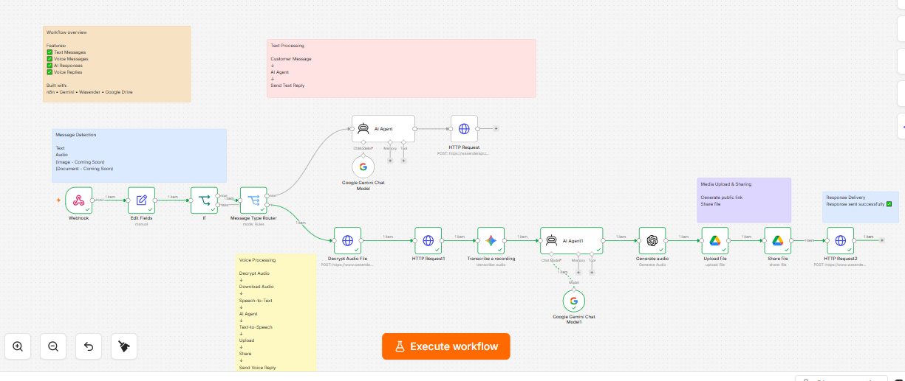
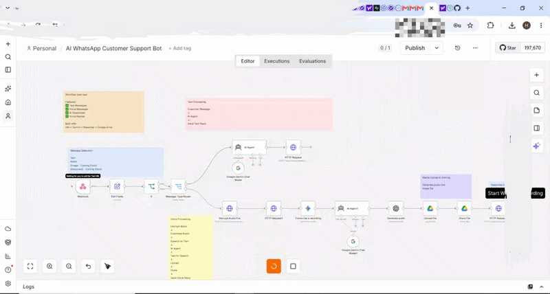
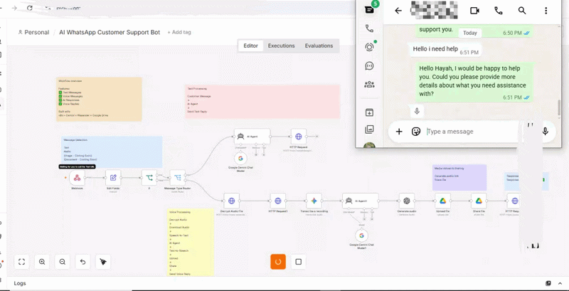

# 🤖 AI WhatsApp Customer Support Agent

An AI-powered WhatsApp Customer Support Agent built with **n8n**, **Google Gemini**, **Wasender API**, and **Google Drive**.

This workflow automatically receives customer messages from WhatsApp, understands both text and voice messages, generates intelligent responses, and replies in the same format.

---

## ✨ Features

- ✅ Receive WhatsApp messages
- ✅ Support Text Messages
- ✅ Support Voice Messages
- ✅ Speech-to-Text (Gemini)
- ✅ AI Customer Support Responses
- ✅ Text-to-Speech
- ✅ Automatic Voice Reply
- ✅ Google Drive Integration
- ✅ Public Audio Sharing
- ✅ WhatsApp Audio Response

---

## 🛠️ Tech Stack

- n8n
- Google Gemini
- Wasender API
- Google Drive
- HTTP Request Nodes

---

## 📊 Workflow

### Text Flow

```
Customer Message
      ↓
AI Agent
      ↓
Send Text Reply
```

### Voice Flow

```
Customer Voice
      ↓
Decrypt Audio
      ↓
Download Audio
      ↓
Speech-to-Text
      ↓
AI Agent
      ↓
Text-to-Speech
      ↓
Upload to Google Drive
      ↓
Share File
      ↓
Send Voice Reply
```

---

## 📂 Project Structure

```
ai-whatsapp-customer-support-agent/
│
├── README.md
├── workflow.json
├── architecture.png
├── demo.mp4
├── LICENSE
└── assets/
```

---

## 🚀 Future Improvements

- Image Understanding (Vision)
- PDF & Document Support
- Conversation Memory
- CRM Integration
- Knowledge Base (RAG)

---

## 📸 Workflow Preview



---

## 🎥 Demo


### 💬 Text Conversation



### 🎙️ Voice Conversation


---

## 📄 License

MIT License

---

## 👩‍💻 Author

**Hiyam Bader**

AI Automation Developer