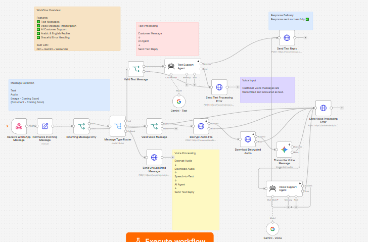

# AI WhatsApp Customer Support Bot

An AI-powered WhatsApp customer support workflow built with **n8n**, **Google Gemini**, and **WaSender API**. It handles incoming text and voice messages, replies in the customer's current language, and provides clear fallback responses when a message cannot be processed.

## Features

- Receives WhatsApp messages through a production webhook
- Filters outgoing messages to prevent reply loops
- Supports Arabic and English text conversations
- Accepts WhatsApp voice messages and transcribes them with Gemini
- Responds to both text and voice input with a text message
- Detects the language of each current message and replies in the same language
- Validates text and voice payloads before processing
- Handles unsupported message types with a clear customer response
- Includes separate error paths for text and voice processing
- Uses customizable business information and support instructions

## Workflow Overview

### Text flow

```text
WhatsApp Webhook
  → Normalize Message
  → Incoming Message Check
  → Message Type Router
  → Validate Text
  → Gemini Support Agent
  → Send Text Reply
```

### Voice flow

```text
WhatsApp Webhook
  → Normalize Message
  → Validate Voice Payload
  → Decrypt and Download Audio
  → Gemini Speech-to-Text
  → Gemini Support Agent
  → Send Text Reply
```

## Error Handling

The workflow includes customer-friendly fallback messages for:

- Empty or invalid text messages
- Missing voice-message metadata
- Audio decryption or download failures
- Transcription or AI-processing failures
- Unsupported images, documents, and other message types

## Tech Stack

- n8n
- Google Gemini
- WaSender API
- WhatsApp
- Webhooks and HTTP Request nodes

## Setup

1. Import `AI WhatsApp Customer Support Bot.json` into n8n.
2. Add your Google Gemini API credential to the Gemini nodes.
3. Replace `YOUR_WASENDER_API_TOKEN` in the WaSender HTTP Request nodes.
4. Configure WaSender to send incoming-message events to your n8n production webhook:

   ```text
   https://YOUR_N8N_DOMAIN/webhook/whatsapp-support
   ```

5. Customize the business information and support rules in both AI Agent system prompts.
6. Activate the workflow and test it from a different WhatsApp number.

> Never commit real API tokens or credentials to a public repository.

## Tested Scenarios

- Arabic text question and Arabic response
- English text question and English response
- Arabic voice message transcribed and answered as text
- Unsupported image handled with a clear fallback message
- Temporary model failure handled with a customer-friendly error response

## Project Structure

```text
13-ai-whatsapp-customer-support-agent/
├── AI WhatsApp Customer Support Bot.json
├── README.md
├── LICENSE
└── assets/
    └── workflow-overview.png
```

## Workflow Preview



## Possible Extensions

- Knowledge-base or RAG integration
- CRM and lead-management integration
- Google Sheets logging and analytics
- Human-agent escalation and notifications
- Image and document understanding
- Optional text-to-speech and voice replies
- Meta WhatsApp Cloud API integration

## License

MIT License. See `LICENSE` for details.

## Author

**Hiyam Bader**

AI Automation Developer
