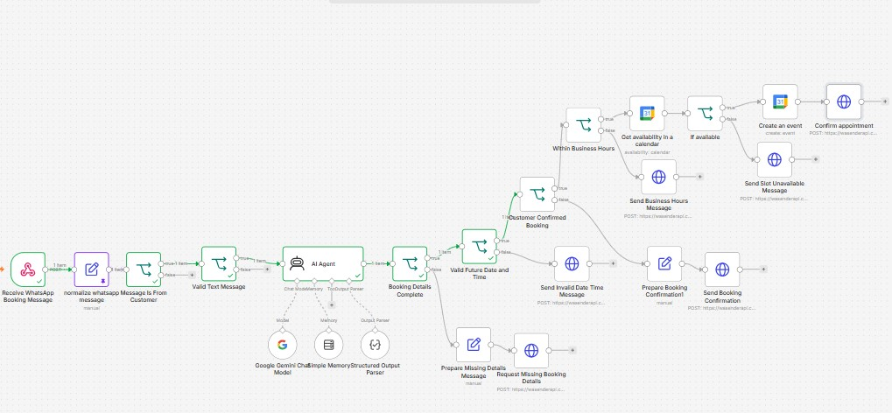

# AI WhatsApp Appointment Booking Agent

An AI-powered appointment booking workflow built with n8n, Google Gemini, Google Calendar, and the Wasender API.

The assistant receives booking requests through WhatsApp, understands natural-language dates and times, collects missing details, asks the customer to confirm, validates the requested time, checks calendar availability, creates the appointment, and sends the appropriate response.


## Features

- Receives appointment requests through a WhatsApp webhook
- Normalizes incoming WhatsApp message data
- Ignores messages sent by the business account
- Validates text messages before processing
- Extracts the service, date, time, and customer name with Google Gemini
- Understands relative dates such as `tomorrow` and `next Tuesday`
- Keeps conversation context for follow-up messages
- Requests missing booking details without inventing information
- Requires explicit customer confirmation before booking
- Rejects invalid or past dates and times
- Enforces business hours:
  - Saturday–Thursday: 9:00 AM–5:00 PM
  - Friday: closed
- Checks Google Calendar for conflicting appointments
- Prevents double booking when a time slot is occupied
- Creates a one-hour Google Calendar event when the slot is available
- Sends confirmation, missing-details, invalid-time, outside-hours, and unavailable-slot responses
- Includes a manual test path for portfolio demonstrations

## Workflow Logic

```text
WhatsApp Webhook / Manual Test
              |
              v
Normalize and Validate Message
              |
              v
AI Booking Details Extraction
              |
              v
Are Details Complete? -- No --> Request Missing Details
              |
             Yes
              v
Is Date and Time Valid? -- No --> Request a New Date and Time
              |
             Yes
              v
Did Customer Confirm? -- No --> Send Booking Summary
              |
             Yes
              v
Within Business Hours? -- No --> Send Business Hours Message
              |
             Yes
              v
Check Google Calendar
       |                 |
    Available          Occupied
       |                 |
Create Event       Send Unavailable Message
       |
Send Success Message
```

## Example Conversation

**Customer**

```text
I'd like to book a dental cleaning next Tuesday at 4 PM.
```

**Assistant**

```text
Please confirm your booking:

Service: dental cleaning
Date: 2026-08-25
Time: 16:00

Reply Yes to confirm.
```

**Customer**

```text
Yes, confirm.
```

The workflow validates the booking, checks Google Calendar, creates the event if the slot is available, and sends the final confirmation.

## Technologies

- n8n
- Google Gemini
- Google Calendar
- WhatsApp
- Wasender API
- LangChain Structured Output Parser
- n8n Simple Memory
- Luxon DateTime expressions

## Setup

1. Import the workflow JSON file into n8n.
2. Configure Google Gemini credentials.
3. Configure Google Calendar OAuth credentials.
4. Select the calendar used for appointment availability and event creation.
5. Add the Wasender API token to the WhatsApp request nodes.
6. Connect the Wasender webhook to the production webhook URL.
7. Review the timezone and business hours for the target business.
8. Test the workflow, then activate it.

## Test Scenarios

- Complete booking request
- Missing date or time
- Past appointment
- Customer confirmation
- Appointment outside business hours
- Friday appointment
- Occupied calendar slot
- Available calendar slot

## Security Before Publishing

Remove or replace all sensitive values before uploading the workflow publicly:

- API keys
- Bearer tokens
- OAuth credentials and credential identifiers
- Webhook secrets
- Phone numbers and customer information
- Calendar identifiers when private

Use placeholders such as:

```text
Bearer YOUR_WASENDER_API_TOKEN
```

## Current Demo Limitation

The workflow logic can be tested locally with the included manual test path. Live WhatsApp sending requires an active Wasender account and valid API token.

The current conversation memory is suitable for a demo. A production deployment should use persistent storage, webhook authentication, idempotency protection, and an error-handling workflow.

## Future Improvements

- Appointment rescheduling and cancellation
- Suggested alternative time slots
- Automated reminders
- Persistent conversation memory
- Customer and lead storage in a CRM or database
- Voice message support
- Multi-service appointment durations
- Admin notifications and error monitoring

## License

This project is licensed under the MIT License.
