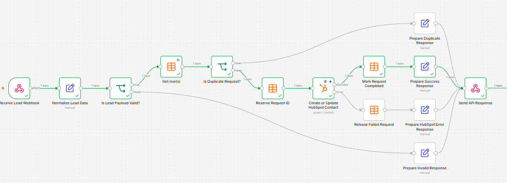

# REST API Webhook & HubSpot CRM Integration

An n8n workflow that exposes a secured REST API endpoint for receiving CRM leads, validating and normalizing their data, and creating or updating contacts in HubSpot.

The workflow includes API-key authentication, idempotency protection, input validation, automatic retries, safe failure recovery, and structured HTTP responses.



## Features

- Receives lead data through a `POST` webhook.
- Protects the endpoint with an `x-api-key` header.
- Normalizes names, email addresses, phone numbers, company details, service, budget, and source.
- Validates the request ID and email address before processing.
- Prevents duplicate processing using an n8n Data Table.
- Creates or updates HubSpot contacts using email as the unique identifier.
- Stores custom CRM fields for service, budget, source, and external request ID.
- Retries temporary HubSpot failures automatically.
- Releases failed request reservations so the same request can be retried safely.
- Returns clear `200`, `400`, `403`, and `502` responses.

## Workflow Logic

1. Receive and authenticate the webhook request.
2. Normalize the incoming lead data.
3. Validate `requestId` and `email`.
4. Check whether the request ID has already been processed.
5. Return a duplicate response when the request already exists.
6. Reserve new request IDs before calling HubSpot.
7. Create or update the HubSpot contact.
8. Mark successful requests as completed.
9. Delete the reservation after a HubSpot failure, allowing a safe retry.
10. Return a structured JSON response.

## Technologies

- n8n
- HubSpot CRM API
- n8n Data Tables
- REST API and Webhooks
- Header authentication
- PowerShell or cURL for API testing

## Required Credentials

Create these credentials in n8n after importing the workflow:

1. **Header Auth**
   - Header name: `x-api-key`
   - Header value: generate a strong secret and keep it private.

2. **HubSpot Private App Token**
   - The private app needs permission to read and write CRM contacts.

Credential values are not included in the exported workflow.

## HubSpot Custom Properties

Create the following contact properties in HubSpot before running the workflow:

| Label | Internal name | Type |
|---|---|---|
| Requested Service | `requested_service` | Single-line text |
| Lead Budget | `lead_budget` | Number or currency |
| Lead Source | `lead_source` | Single-line text |
| Request ID | `external_request_id` | Single-line text |

## Data Table Setup

Create an n8n Data Table named `api_request_log` with these columns:

| Column | Type |
|---|---|
| `requestId` | String |
| `email` | String |
| `status` | String |
| `hubspotContactId` | String |
| `operation` | String |
| `processedAt` | Date & time |
| `errorMessage` | String |

After importing the workflow, select your own Data Table in every Data Table node because table IDs are environment-specific.

## Request Body

```json
{
  "requestId": "lead-001",
  "name": "Sara Khaled",
  "email": "sara.khaled@example.com",
  "phone": "+970599101010",
  "company": "Sara Clinic",
  "service": "WhatsApp Automation",
  "budget": 1600,
  "source": "Website"
}
```

Only `requestId` and a valid `email` are required. The remaining fields are optional.

## PowerShell Test

```powershell
$crmApiKey = Read-Host "Enter the CRM API key"

Invoke-RestMethod -Method Post `
  -Uri "https://YOUR_N8N_HOST/webhook/crm-lead" `
  -Headers @{ "x-api-key" = $crmApiKey } `
  -ContentType "application/json" `
  -Body (@{
    requestId = "lead-001"
    name = "Sara Khaled"
    email = "sara.khaled@example.com"
    phone = "+970599101010"
    company = "Sara Clinic"
    service = "WhatsApp Automation"
    budget = 1600
    source = "Website"
  } | ConvertTo-Json)
```

## cURL Test

```bash
curl -X POST "https://YOUR_N8N_HOST/webhook/crm-lead" \
  -H "Content-Type: application/json" \
  -H "x-api-key: YOUR_API_KEY" \
  -d '{
    "requestId": "lead-001",
    "name": "Sara Khaled",
    "email": "sara.khaled@example.com",
    "phone": "+970599101010",
    "company": "Sara Clinic",
    "service": "WhatsApp Automation",
    "budget": 1600,
    "source": "Website"
  }'
```

## Example Responses

Successful create or update:

```json
{
  "success": true,
  "duplicate": false,
  "statusCode": 200,
  "requestId": "lead-001",
  "hubspotContactId": "HUBSPOT_CONTACT_ID",
  "message": "Contact created or updated successfully"
}
```

Duplicate request:

```json
{
  "success": true,
  "duplicate": true,
  "statusCode": 200,
  "requestId": "lead-001",
  "message": "Request already processed"
}
```

Invalid request:

```json
{
  "success": false,
  "statusCode": 400,
  "error": "Invalid request",
  "message": "requestId and a valid email are required"
}
```

Temporary HubSpot failure:

```json
{
  "success": false,
  "statusCode": 502,
  "requestId": "lead-001",
  "error": "HubSpot integration failed",
  "message": "The request can be retried safely"
}
```

## Import and Run

1. Import `workflow.json` into n8n.
2. Create and select the Header Auth credential.
3. Create and select the HubSpot private app credential.
4. Create the required HubSpot custom properties.
5. Create the `api_request_log` Data Table and select it in all Data Table nodes.
6. Test the workflow with the webhook test URL.
7. Activate the workflow and use the production webhook URL.

## Security Notes

- Never commit API keys or HubSpot private app tokens.
- Use HTTPS for public production endpoints.
- Rotate a key immediately if it is exposed.
- Store secrets only in n8n Credentials or another secure secret manager.

## Author

**Hiyam Bader**  
n8n, API integration, CRM automation, and AI automation.
