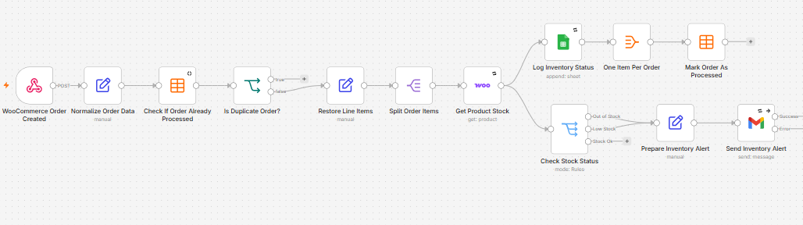

# WooCommerce Orders & Inventory Automation with n8n

Production-style n8n automation for processing WooCommerce orders, monitoring inventory, preventing duplicate processing, sending stock alerts, and logging operational data with retry and error-handling mechanisms.



## The problem

WooCommerce stores can receive repeated webhook deliveries, orders can contain multiple products, and inventory checks may fail because of temporary API or network issues. A reliable automation should process every order item, avoid duplicate side effects, surface low-stock conditions, and leave an operational trail for troubleshooting.

## What this workflow does

When WooCommerce creates an order, the workflow normalizes the payload and checks an n8n Data Table to determine whether the order was already processed. New orders are split into individual line items, each product is retrieved from WooCommerce, and its current stock is classified as **OK**, **LOW_STOCK**, or **OUT_OF_STOCK**. Inventory results are appended to Google Sheets, low/out-of-stock products trigger Gmail alerts, and the order is marked as processed only once after all item logging is complete.

## Architecture

`WooCommerce Webhook → Normalize → Idempotency Check → Restore Line Items → Split Items → Get Product Stock → Inventory Log / Stock Classification → Alert (when needed) → Aggregate → Mark Order Processed`

A separate error workflow captures failed executions and writes diagnostic information to an error log.

## Key features

- WooCommerce order-created webhook ingestion
- Normalized order payload for predictable downstream processing
- Idempotency check using an n8n Data Table
- Multi-product order processing with Split Out
- Live WooCommerce product stock lookup
- Stock classification for OK, low-stock, and out-of-stock states
- Google Sheets inventory audit log
- Gmail alerts for low/out-of-stock products
- Retry behavior on external-service nodes
- Non-critical notification failures configured not to block core processing
- Aggregation so one multi-item order is marked processed only once
- Central error workflow with execution diagnostics

## Reliability design

### Duplicate protection

Before inventory processing begins, the workflow searches the `Processed WooCommerce Orders` Data Table by `orderId`. Existing orders stop at the duplicate branch. New orders continue and are recorded after successful core processing.

This provides practical webhook idempotency for normal sequential deliveries. It is **not an atomic exactly-once guarantee under true concurrent duplicate deliveries**. A production system with high concurrency should use a unique database constraint, atomic upsert/lock, or another concurrency-safe mechanism.

### Multi-item orders

The order's `lineItems` array is split so every product is checked independently. After inventory logging, `One Item Per Order` aggregates the item-level outputs before `Mark Order As Processed`, preventing one processed-order record per product.

### Retries and failure handling

WooCommerce, Google Sheets, and Gmail integrations use retry behavior where appropriate. Gmail alert delivery is treated as a non-critical side effect, while core processing failures can be routed to the separate error workflow for diagnosis.

## Error workflow

`error-handler-workflow.json` contains a reusable Error Trigger flow that prepares and logs:

- Timestamp
- Workflow name
- Execution ID
- Failed node
- HTTP code
- Error message
- Execution URL
- Raw error payload

After importing it, configure its Google Sheets credential and destination sheet, then select it as the main workflow's **Error Workflow** in n8n settings.

## Testing performed

The workflow was tested with multi-product orders and duplicate webhook deliveries. Tests covered normal stock, low stock, out-of-stock paths, inventory logging, alert delivery, and one processed-order record per order. Failure recovery was also tested by forcing an invalid WooCommerce product ID, confirming the failed order was not marked processed, restoring the valid product ID, and replaying the order successfully.

## Setup

1. Import `workflow.json` into n8n.
2. Configure your WooCommerce API credential.
3. Configure Google Sheets OAuth and replace `YOUR_GOOGLE_SHEET_ID`.
4. Create an n8n Data Table with `orderId`, `orderNumber`, and `processedAt`, then replace `YOUR_N8N_DATA_TABLE_ID`.
5. Configure Gmail OAuth and replace `YOUR_ALERT_EMAIL@example.com`.
6. Import `error-handler-workflow.json`, configure its Google Sheet, and select it as the main workflow's Error Workflow.
7. Activate the main workflow and copy its production webhook URL into the WooCommerce order-created webhook configuration.

### Inventory log columns

`Timestamp`, `Order Number`, `Product`, `SKU`, `Ordered Qty`, `Current Stock`, `Low Stock Threshold`, `Status`

### Processed-order Data Table

`orderId` (String), `orderNumber` (String), `processedAt` (DateTime)

## Important note about inventory

WooCommerce remains the source of truth for stock changes. This workflow **monitors and reports inventory after order events; it does not deduct stock a second time**.

## Repository structure

```text
.
├── README.md
├── workflow.json
├── error-handler-workflow.json
├── .gitignore
└── assets/
    └── workflow-overview.png
```

## Security

The public workflow files use placeholders for account-specific resource IDs and credential references. Do not commit API keys, OAuth secrets, webhook secrets, private customer data, personal email addresses, or temporary tunnel URLs to a public repository.

## Tech stack

n8n · WooCommerce · Google Sheets · Gmail · n8n Data Tables · Webhooks · Docker

## Portfolio focus

This project demonstrates event-driven business automation, webhook processing, idempotency, multi-item data flow, external API integration, inventory monitoring, retry strategy, error handling, and operational logging in n8n.
