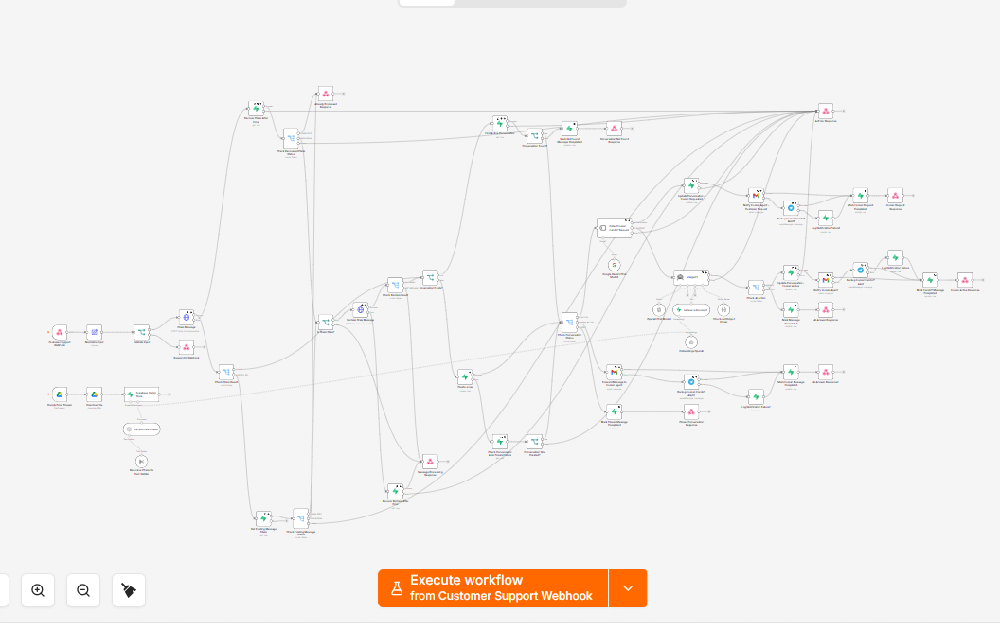
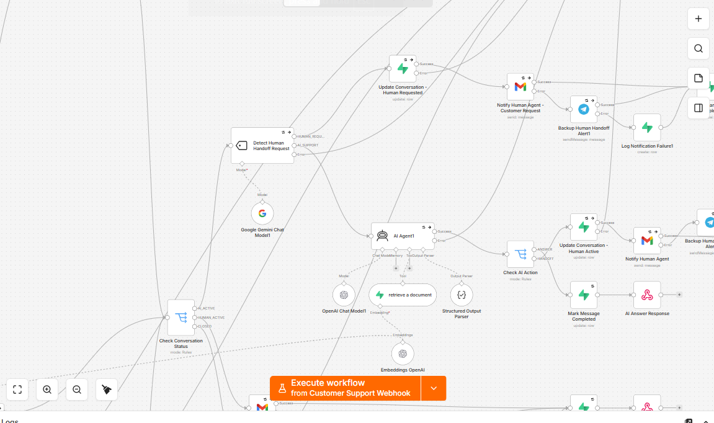

# AI Customer Support Agent with RAG & Human Handoff

A production-oriented n8n customer-support automation that combines RAG-based answers, conversation state, explicit human-handoff detection, resilient notification fallbacks, and atomic message idempotency.

## Workflow Overview



## AI, RAG & Human Handoff



## What it does

A customer sends a support request through a webhook. The workflow validates and claims the message, manages the conversation lifecycle, detects explicit requests for a human agent, and otherwise sends the question to an AI agent that must retrieve information from the knowledge base before answering.

The conversation state is:

`AI_ACTIVE -> HUMAN_ACTIVE -> CLOSED`

If the knowledge base cannot answer the question, or the request requires a real human action, the workflow transfers the conversation to human support. Email is the primary notification channel, Telegram is the fallback, and final notification failures are logged in Supabase.

## Key features

- RAG knowledge base backed by Supabase Vector Store
- OpenAI embeddings with a 1536-dimensional vector store
- GPT-5 mini support agent with structured `ANSWER` / `HANDOFF` output
- Gemini classifier for explicit human-support requests
- Google Drive knowledge-base ingestion
- Conversation lifecycle management in Supabase/PostgreSQL
- Atomic idempotency claim using PostgreSQL RPC
- Duplicate-message protection
- Stale `PROCESSING` claim recovery after five minutes
- Conservative recovery after ambiguous claim/reclaim failures
- Human handoff through Gmail with Telegram fallback
- Notification-failure logging
- Retry handling and controlled HTTP 400 / 404 / 202 / 503 responses
- Safe recovery when conversation creation succeeds but its response is lost

## Architecture

```text
Customer / App
      |
   Webhook
      |
Validate Input
      |
Atomic Message Claim
      |
Conversation State
      |
Human Request Classifier
   /             \
Human             AI Support
 |                    |
Handoff          RAG Retrieval
 |                    |
Email/Telegram    AI Agent
                      |
                 ANSWER / HANDOFF
```

Knowledge-base ingestion:

```text
Google Drive
    |
Download File
    |
Chunk Documents
    |
OpenAI Embeddings
    |
Supabase Vector Store
```

## Reliability design

This workflow deliberately handles more than the happy path.

Each `messageId` is claimed atomically in PostgreSQL before processing. A duplicate message cannot start a second normal execution. Existing claims can be `PROCESSING` or `COMPLETED`. A fresh processing claim returns HTTP 202, while a stale claim can be reclaimed after five minutes.

If the initial claim request has an ambiguous transport failure, the workflow reads the database state instead of blindly processing the message. The stale-reclaim path uses the same conservative principle.

Conversation creation also has recovery logic. If the insert appears to fail after the database may already have committed it, the workflow looks up the conversation using the unique `initial_message_id` before deciding whether to return a service error.

## Human handoff

Human support can be triggered in three ways:

1. The customer explicitly asks for a human agent.
2. The RAG knowledge base does not contain enough information.
3. The issue requires a human action such as account-specific intervention.

Once a conversation becomes `HUMAN_ACTIVE`, subsequent customer messages bypass the AI agent and are forwarded to human support.

## Setup

1. Import `workflow.json` into n8n.
2. Run `sql/supabase-schema.sql` in Supabase.
3. Configure your n8n credentials for Supabase, OpenAI, Google Gemini, Google Drive, Gmail, Telegram, and webhook header authentication.
4. Replace `YOUR_PROJECT_REF` in the Supabase RPC HTTP Request nodes.
5. Select your Google Drive knowledge-base folder.
6. Replace `support@example.com` with the human-support inbox.
7. Replace `YOUR_TELEGRAM_CHAT_ID` with the fallback Telegram chat ID.
8. Upload knowledge-base documents to the configured Drive folder.
9. Activate the workflow and call the production webhook from your application.

## Example request

```json
{
  "messageId": "msg_8f31c2",
  "customerId": "C1024",
  "name": "John",
  "email": "john@example.com",
  "message": "What is your return policy?"
}
```

For later messages in the same conversation, include the returned `conversationId`.

## Example AI response

```json
{
  "success": true,
  "conversationId": "<uuid>",
  "status": "AI_ACTIVE",
  "answer": "<answer retrieved from the knowledge base>"
}
```

## Tested scenarios

The workflow was tested for normal RAG answers, duplicate message IDs, existing conversations, explicit human requests, knowledge-not-found handoffs, human-action-required handoffs, follow-up messages during `HUMAN_ACTIVE`, invalid input, missing conversations, closed conversations, AI failures, database failures, email-to-Telegram fallback, notification logging, fresh processing claims, stale claim recovery, and claim-service failures.

## Security

The public workflow export in this repository is sanitized. Credential references, personal notification destinations, project-specific identifiers, webhook identifiers, and instance metadata are removed or replaced with placeholders.

Never commit API keys, access tokens, service-role keys, production webhook secrets, or unsanitized n8n exports.

## Files

```text
18-ai-customer-support-rag-human-handoff/
├── README.md
├── workflow.json
├── assets/
│   ├── workflow-overview.png
│   └── ai-rag-human-handoff.png
└── sql/
    └── supabase-schema.sql
```

## Tech stack

n8n · Supabase/PostgreSQL · pgvector · OpenAI · Google Gemini · Google Drive · Gmail · Telegram
